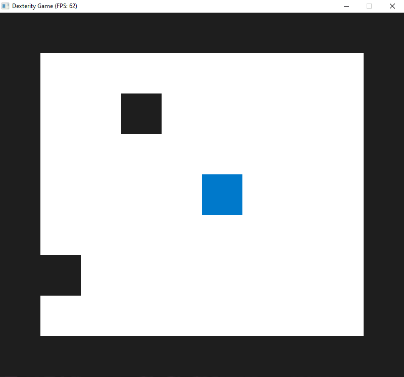

# CPPND: Capstone Dexterity Game

This repo serves as my Capstone project for the [Udacity C++ Nanodegree Program](https://www.udacity.com/course/c-plus-plus-nanodegree--nd213). The inspiration for this project was a puzzle game by the same name, developed by SNK Corporation, originally released in 1990 for the Nintendo Game Boy.



Some aspects of the code were adapted from [this sample project](https://github.com/udacity/CppND-Capstone-Snake-Game) provided by Udacity. My reference for building a game using SDL came from [these excellent tutorials](https://lazyfoo.net/tutorials/SDL/) provided by Lazy Foo' Productions.

## Dependencies for Running Locally

* cmake >= 3.7
  * All OSes: [click here for installation instructions](https://cmake.org/install/)
* make >= 4.1 (Linux, Mac), 3.81 (Windows)
  * Linux: make is installed by default on most Linux distros
  * Mac: [install Xcode command line tools to get make](https://developer.apple.com/xcode/features/)
  * Windows: [Click here for installation instructions](http://gnuwin32.sourceforge.net/packages/make.htm)
* SDL2 >= 2.0
  * All installation instructions can be found [here](https://wiki.libsdl.org/Installation)
  * Note that for Linux, an `apt` or `apt-get` installation is preferred to building from source.
* gcc/g++ >= 5.4
  * Linux: gcc / g++ is installed by default on most Linux distros
  * Mac: same deal as make - [install Xcode command line tools](https://developer.apple.com/xcode/features/)
  * Windows: recommend using [MinGW](http://www.mingw.org/)

## Basic Build Instructions

1. Clone this repo.
2. Make a build directory in the top level directory: `mkdir build && cd build`
3. Compile: `cmake .. && make`
4. Run it: `./DexterityGame`.

## File & Class Structure

```
├─── build
├─── src
|    ├─── controller.cpp
|    ├─── controller.h
|    ├─── game.cpp
|    ├─── game.h
|    ├─── gameboard.cpp
|    ├─── gameboard.h
|    ├─── main.cpp
|    ├─── player.cpp
|    ├─── player.h
|    ├─── renderer.cpp
|    └─── renderer.h
├─── CMakeLists.txt
├─── code_structure.png
└─── README.md
```


## Expected Behavior

### Gameplay

The objective of the game is to "flip" every tile on the game board to your Player (blue square) color.

When the Player uses their `Activate` ability, the tile they are standing on will flip colors; if open (white) it becomes closed (blue), or vice versa.

Tiles may be flipped in a chain if the row or column makes a connection to an already claimed tile.

Each game session will randomly block out two tiles in the middle of the game board; these blocked tiles will interupt chained tile flipping.

### Controls

  Move Up, `W` or `Up`  
  Move Down, `S` or `Down`  
  Move Left, `A` or `Left`  
  Move Right, `D` or `Right`  
  Activate, `E` or `Space`  

## Rubric Points

### README

:white_check_mark: A README with instructions is included with the project

:white_check_mark: The README indicates which project is chosen

:white_square_button: The README includes information about each rubric point addressed

### Compiling and Testing

:white_check_mark: The submission must compile and run

### Loops, Functions, I/O

:white_check_mark: The project accepts user input and processes the input

- The `Controller::HandleInput()` method in `src/controller.cpp` starting at line 17 accepts user input to control the character through `WASD` or `Arrow` keys, and allows the player to interact with a tile on the game board through `Space` or `E` keys.

### Object Oriented Programming

:white_check_mark: The project uses Object Oriented Programming techniques

- The project is composed of several Classes, each containing relevant member attributes and methods to access or modify those attributes.
  - The `Game` class defined in `src/game.h`
  - The `GameBoard` class defined in `src/gameboard.h`
  - The `Player` class defined in `src/player.h`

:white_check_mark: Classes use appropriate access specifiers for class members

- Here are a couple examples of using appropriate access specifiers in my custom classes.
  - The `Game` class defined in `src/game.h` sets the methods `Game::Run()`, `Game::FlipSingleTile()` and `Game::FlipChainedTiles()`, along with the attributes `Game::playerWins` and `Game::gameBoard` public as they are accessed from other classes. The methods `Game::FindBoundingTiles()`, `Game::CheckWinCondition()` and `Game::Update()` as well as attributes `Game::player`, `Game::_gridWidth` and `Game::_gridHeight` are private as they are only referenced within their own class.
  - The `Player` class defined in `src/player.h` sets the method `Player::Update()` and attributes `Player::direction`, `Player::speed`, `Player::alive`, `Player::posX`, `Player::posY` and `Player::activeTile` public as they are access from other classes. The methods `Player::UpdatePosition()` and `Player::UpdateActiveTile()` along with attributes `Player::_gridWidth` and `Player::_gridHeight` are private as they are only referenced within their own class.

### Memory Management

:white_check_mark: The project makes use of references in function declarations

- The method `GameBoard::GetTileState()` defined in `src/gameboard.h` at line 15 accepts a reference to an `SDL_Point` object as its only argument
- The method `GameBoard::SetTileState()` defined in `src/gameboard.h` at line 16 accepts a reference to an `SDL_Point` object as one of its arguments
- The method `Controller::ChangeDirection()` defined in `src/controller.h` at line 15 accepts a reference to a `Player` object as one of its arguments
- The method `Controller::Active()` defined in `src/controller.h` at line 16 accepts a reference to a `Player` object and `Game` object as its two arguments.

:white_check_mark: The project uses smart pointers instead of raw pointers

- The `Game` class defined in `src/game.h` uses a `std::shared_ptr<GameBoard>` at line 28 for referencing the member `GameBoard` class instance.

### Concurrency

:white_check_mark: The project uses multithreading

- The method `Game::FlipChainedTiles` defined in `src/game.h` at line 24 and implemented in `src/game.cpp` at line 69 creates a `std::vector<std::thread>` for each tile that will be flipped.
  - Threads are started with a variadic template with a `std::shared_ptr` reference to the instance of `Game` to ensure the object is kept until all threads are completed
  - Each thread sleeps for progressively longer points of time to simulate the effect of the tiles flipping one after another in a chain (each row/column chain starts at a delay of 0ms).
  - All threads are detachs so as to not to hault the game

:black_square_button: A mutex or lock is used in the project

- The `GameBoard` class uses a `std::mutex` to make mutations of the game board vector thread safe.
  - The method `GameBoard::GetTileState` implemented in `src/gameboard.cpp` at line 51 uses a `std::lock_guard` to ensure the `_board` vector is not mutated while returning the specific tile state
  - The method `GameBoard::SetTileState` implemented in `src/gameboard.cpp` at line 57 uses a `std::lock_guard` to ensure the `_board` vector is not mutated while setting the specific tile state
  - The method `GameBoard::GetBoard` implemented in `src/gameboard.cpp` at line 71 uses a `std::lock_guard` to ensure the `_board` vector is not mutated while it is being returned.
  - The method `GameBoard::Generate` implemented in `src/gameboard.cpp` at line 10 initializes a `std::unique_lock` with its deferred constructor, which is later used at lines 29-31 and lines 44-46 to ensure the `_board` vector is not mutated while setting the initial game board state (though impossible in the current game code, this was done to prepare for a future case where the board may be regenerated in subsequent game turns, which may result in background threads still existing at time of regeneration).

:black_square_button: A condition variable is used in the project
